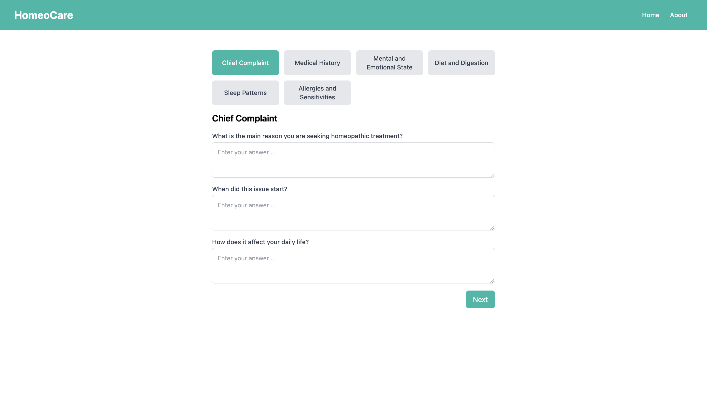

# Homuse Care - AI (by Kartik A. Naphade)

## Description

HomeoCare is an application designed to provide holistic health solutions using homeopathic principles. It aims to assist users in finding personalized homeopathic remedies based on their symptoms and health history.

**Free to Use**: This application includes a built-in free homeopathic suggestion system that works without any API keys or costs. You can also optionally use OpenAI API for more advanced AI-powered suggestions (requires API key).

## Key Features

- **Personalized Recommendations**: Tailored homeopathic remedies based on user input.
- **Symptom Tracker**: Track and manage symptoms over time.
- **Educational Resources**: Information on homeopathic treatments and principles.
- **User-Friendly Interface**: Intuitive design for easy navigation and use.

## Installation

To install HomeoCare, follow these steps:

1. Clone the repository: `git clone https://github.com/KartikNaphade2004/Homeocare`
2. Install dependencies: `npm install`
3. Start the application: `npm run dev` (for development) or `npm start` (for production)

### Free Usage (No API Key Required)

The application works **completely free** out of the box using a built-in rule-based homeopathic suggestion system. No API keys or configuration needed!

### Optional: OpenAI Integration

For enhanced AI-powered suggestions, you can optionally add your OpenAI API key:
1. Create a `.env.local` file in the root directory
2. Add: `OPENAI_API_KEY=your_api_key_here`
3. For Vercel deployment, add the environment variable in your project settings

## Usage

1. **Symptom Input**: Describe your symptoms and health history to receive suggested homeopathic remedies.
2. **Explore Resources**: Learn more about homeopathy and how it can support your health journey.

## Technologies Used

- Frontend: React.js, Next.js
- Backend: Node.js, Express.js
- AI: Built-in rule-based system (free) + Optional OpenAI API integration

## Contributing

Contributions are welcome! Please fork the repository and submit pull requests to propose changes.
